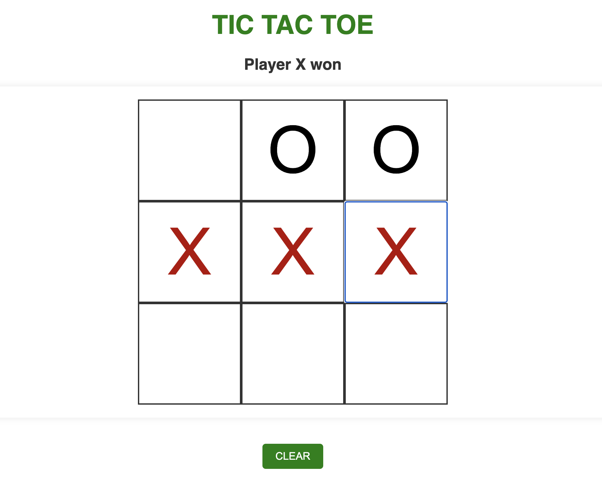
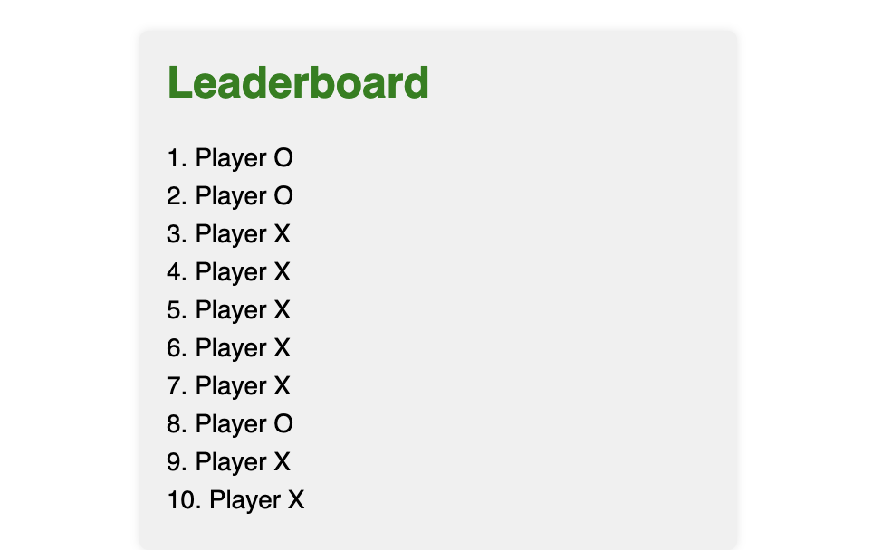
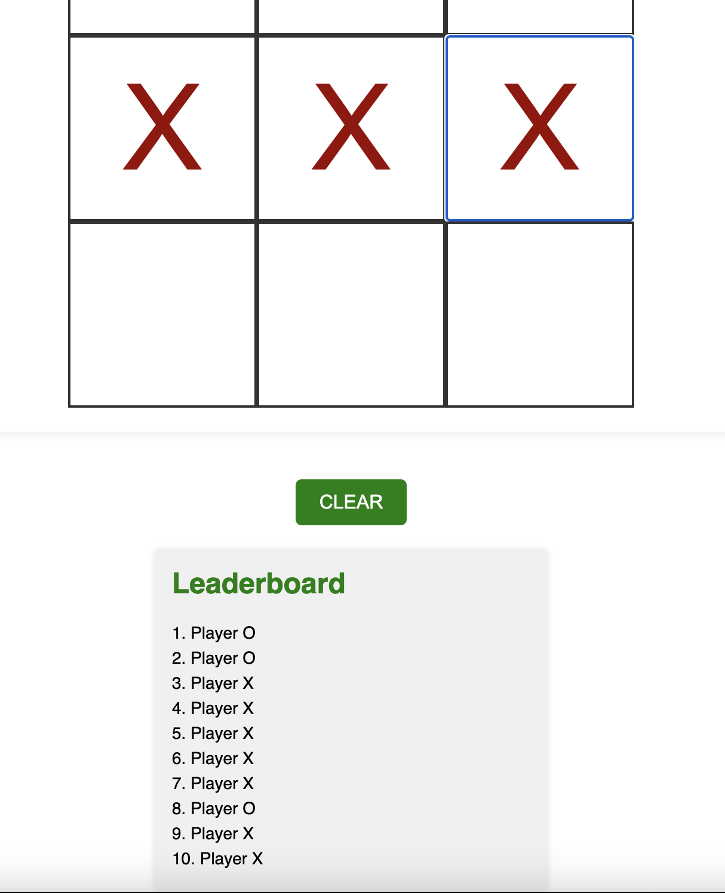

# Version 2: TicTacToe_Server_Side

TicTacToe_server_side game repo can be viewed through our [portfolio website](https://alperenakin.github.io/portfolio/). It is linked under the 'projects' section.
**View the [Setting up the local] server section to see how to play the game with local server

## Version 1: TicTacToe Game without LeaderBoard/Local Server
Our [inital game](https://alperenakin.github.io/TicTacToe/) did not have a leaderboard component (in /versions/v01).

Repo: [version 1](https://github.com/AlperenAkin/TicTacToe)

## Version 2: Using php to manage server side interaction and store winner data (LeaderBoard)

New version of the Tic Tac Toe game implemented using HTML, CSS, PHP, AJAX and JavaScript.

### Setting up the local server

1. Download php. (Homebrew: brew install php)
2. Clone this [repo](https://github.com/tahze0/TicTacToe_Server_Side)
3. Open the cloned repository directory in the command line
4. Type "php -S localhost:8000" to set up local server
5. Enter "localhost:8000" in your browser to play

### How to Play

- The game is played on a 3x3 grid.
- Player X will start the game.
- Players take turns clicking on the empty cells.
- The first player to get three of their marks in a row (horizontally, vertically, or diagonally) wins.
- If all the cells are filled and neither player has three in a row, the game is a draw.
- Most wins out of the 10 games is the winner. Draws dont count as a game.
  If both players have 5 wins, winner of the next game takes it all.

### Features

- Leaderboard to keep track od the winners of the last 10 games
- Smooth transition effects for cell interactions.
- Visual indication of the player's turn.
- Clear button to reset the game board.
- Animated highlighting of the winning cells

### Screenshots

#### Board 

#### LeaderBoard

#### Game with LeaderBoard

